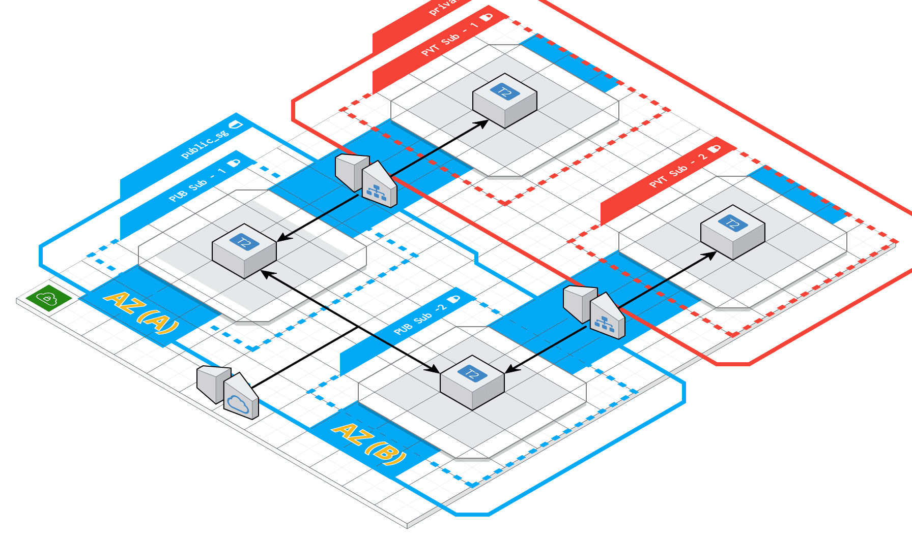

# HA-VPC
> High availability architecture for AWS.

Just a basic vpc with 4 subnets (2 publics and 2 privates) in 2 differents availability zones (A & B) connected with nat gateways, internet gateways, route tables, etc.

Terraform and AWS practice.



### Prerequisites

- terraform (version used v0.13.4)
- aws account

On `~/.aws/credentials`
```
[default]
aws_access_key_id=YOUR_ACCESS_KEY_ID
aws_secret_access_key=YOUR_SECRET_ACCESS_KEY
```

## Deployment
```sh
./deploy.sh
```

## Authors
* **Carlos Catalán** - [Github](https://github.com/catalan94)